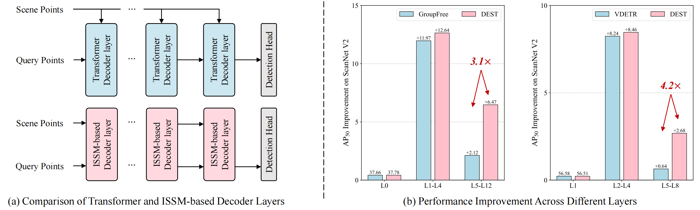
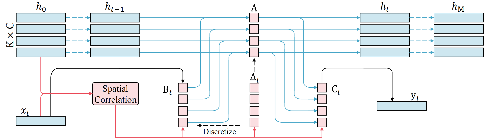
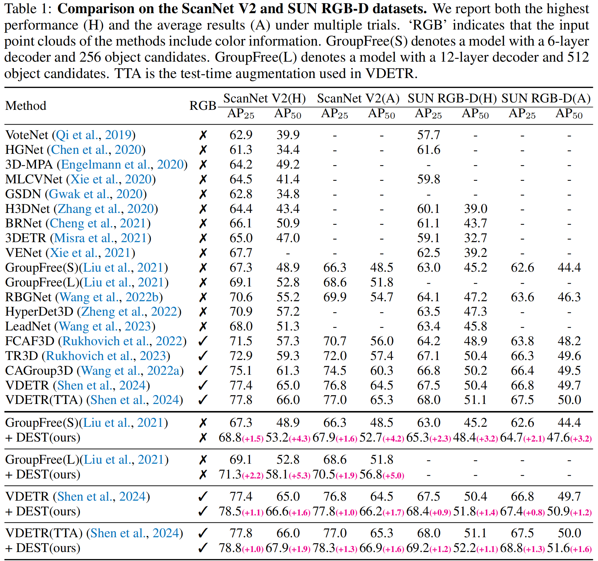
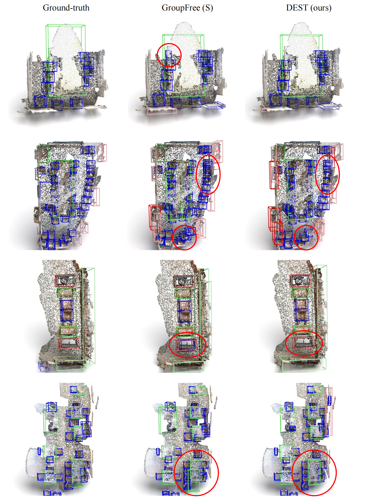
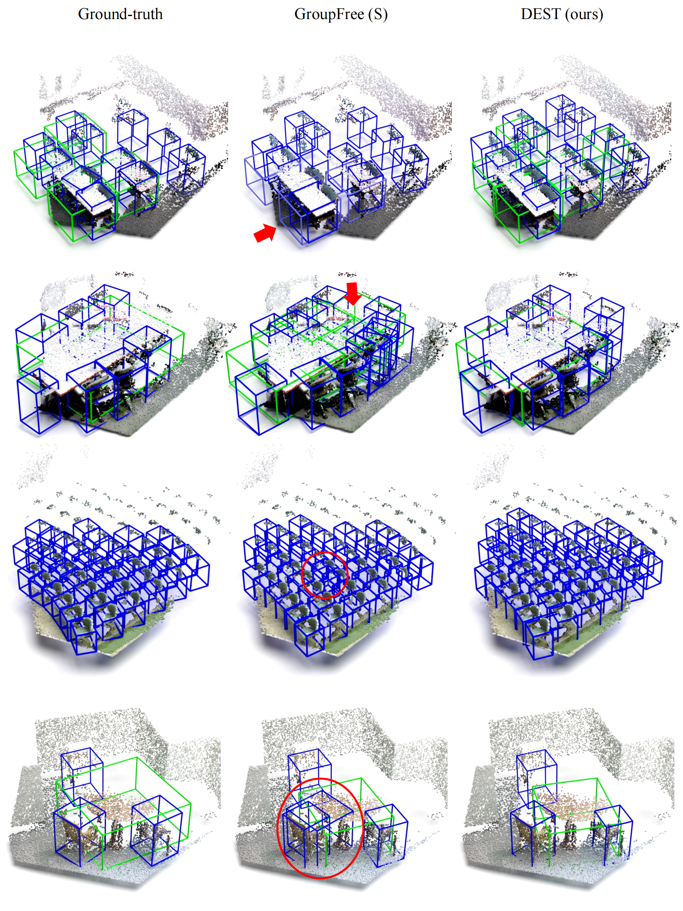

# DEST [ICLR 2025](https://openreview.net/forum?id=Tisu1L0Jwt)

## State Space Model Meets Transformer: A New Paradigm for 3D Object Detection
[](https://paperswithcode.com/sota/3d-object-detection-on-scannetv2?p=state-space-model-meets-transformer-a-new-1)
[](https://paperswithcode.com/sota/3d-object-detection-on-sun-rgbd-val?p=state-space-model-meets-transformer-a-new-1)

By [Chuxin Wang](https://chuxwa.github.io/), Wenfei Yang, Xiang Liu, and Tianzhu Zhang.

This repo is the official implementation of ["State Space Model Meets Transformer: A New Paradigm for 3D Object Detection"](https://openreview.net/forum?id=Tisu1L0Jwt).


## Introduction
DETR-based methods, which use multi-layer transformer decoders to refine object queries iteratively, have shown promising performance in 3D indoor object detection. However, the scene point features in the transformer decoder remain fixed, leading to minimal contributions from later decoder layers, thereby limiting performance improvement. 
<div  align="center">    
 
</div>
Inspired by SSMs, we propose a new 3D object DEtection paradigm with an interactive STate space model (DEST). In the interactive SSM, we design a novel state-dependent SSM parameterization method that enables system states to effectively serve as queries in 3D indoor detection tasks. In addition, we introduce four key designs tailored to the characteristics of point cloud and SSM: The serialization and bidirectional scanning strategies enable bidirectional feature interaction among scene points within the SSM. The inter-state attention mechanism models the relationships between state points, while the gated feed-forward network enhances inter-channel correlations. To the best of our knowledge, this is the first method to model queries as system states and scene points as system inputs, which can simultaneously update scene point features and query features with linear complexity. 
In this repository, we provide model implementation (with Pytorch) as well as data preparation, training and evaluation scripts on ScanNet and SUN RGB-D.

## Interactive State Space Model

<div  align="center">    
 
</div>
In the ISSM, we model the query points as the system states and the scene points as the system inputs. Unlike previous SSMs (Gu et al., 2021a; Gu & Dao, 2023; Dao & Gu, 2024), the proposed ISSM determines how to update the system states based on both the system states and system inputs. Specifically, we modify the SSM parameters (∆, B, C) to be dependent on the system states and design a spatial correlation module to model the relationship between state points and scene points. Therefore, the system states in the ISSM can effectively fulfill the role of queries in complex 3D indoor detection tasks.

## Main Results
<div  align="center">    
 
</div>

### Visual Comparison on ScanNet V2

<div  align="center">    
 
</div>

### Visual Comparison on SUN RGB-D

<div  align="center">    
 
</div>

## Usage
- [Released]  Interactive State Space Model, Implementation available at: [MultiHeadISSMScan](models/dest_module.py)
- [Released] DEST Framework (based on GroupFree3D), Implementation available at: [DestDetector](models/dest_detector.py)
- [Planned Releases] Training & Evaluation Pipeline
- [Planned Releases] DEST Framework (based on VDETR)

Please refer to [test_issm.py](test_issm.py) for using the ISSM module. 

Our testing environment is based on python==3.8.19, pytorch==1.12.1+cu113, and triton==3.0.0. 

Note that the first execution of the code will be relatively slow due to Triton's JIT (Just-In-Time) compilation process, but subsequent runs will achieve normal speed as the compiled kernels are cached.

Below are our simple test results on a single NVIDIA RTX 3090 GPU:
'''
1: Time taken: 0.0014648370000003297 seconds
2: Time taken: 0.0015144770000006247 seconds
3: Time taken: 0.0014919310000038877 seconds
4: Time taken: 0.001444603999999572 seconds
5: Time taken: 0.001540446000007023 seconds
6: Time taken: 0.0014789960000030078 seconds
'''

## Acknowledgements

We thank a lot for the flexible codebase of [GroupFree3D](https://github.com/zeliu98/Group-Free-3D) and [VDETR](https://github.com/V-DETR/V-DETR).

## Citation

```
@inproceedings{wangstate,
  title={State Space Model Meets Transformer: A New Paradigm for 3D Object Detection},
  author={Wang, Chuxin and Yang, Wenfei and Liu, Xiang and Zhang, Tianzhu},
  booktitle={The Thirteenth International Conference on Learning Representations}
}
```